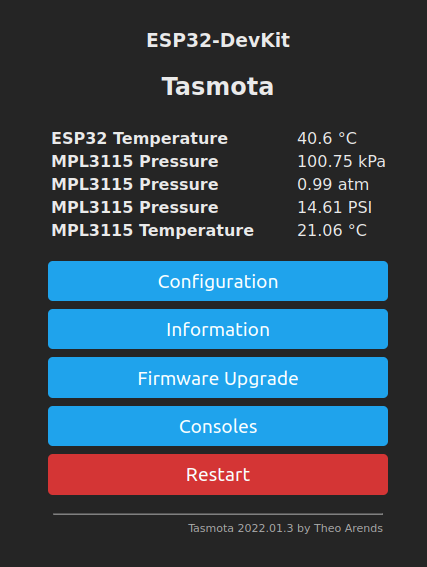

# tasmota32-mpl3115

A (very) simple I2C driver for the MPL3115 atmospheric pressure sensor for Tasmota32

I've had a lot of fun playing around with Tasmota, using it to sense various things like temperature and particulate counts in my garage.
I was intrigued that the version for the ESP32 included a scripting language called "Berry" that could be used to write simple,
low performance I2C drivers.  As it happens, I had an Adafruit MPL3115 based pressure/altimeter board that was unsupported by 
the base Tasmota firmware, so I decided to give it a whirl.

Using the example code from the Berry Cookbook and the MPL3115 datasheet, I coded up a sensor in a couple of hours.  Nifty!

To use it, upload the mpl3115p.be file to the Tasmota32 module, and then add load("mpl3115p.be") to the autoexec.be file
on your sensor node.
